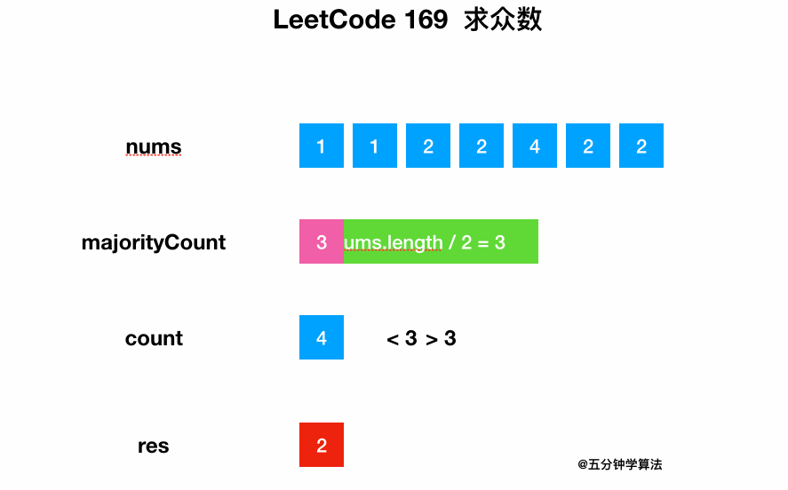
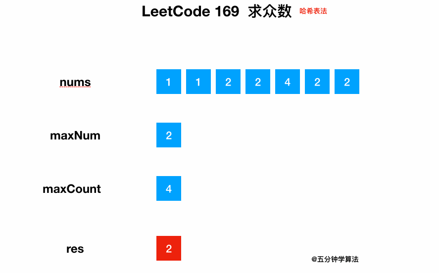
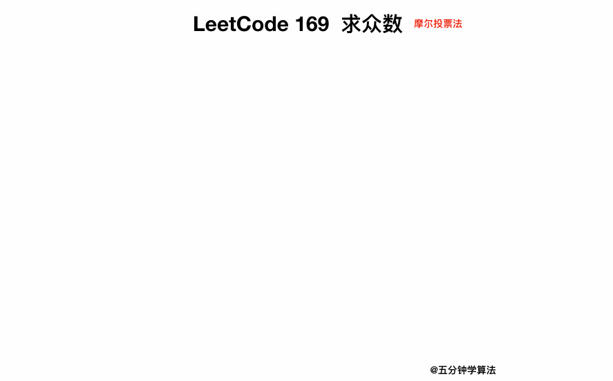

# 【数组中超过一半的数字】三种解法，最后一个解法太牛逼了！

今天分享的题目来源于 LeetCode 上第 169 号问题：求众数（求数组中超过一半的数字）。题目难度为 Easy，目前通过率为 45.8% 。

最后一种解法 **Cool** ！！！

# 题目描述

给定一个大小为 n 的数组，找到其中的众数。众数是指在数组中出现次数大于 ⌊ n/2 ⌋ 的元素。

你可以假设数组是非空的，并且给定的数组总是存在众数。

**示例 1:**

```
输入: [3,2,3]
输出: 3
```

**示例 2:**

```
输入: [2,2,1,1,1,2,2]
输出: 2
```

# 题目解析

题目意思很好理解：给你一个数组，里面有一个数字出现的次数超过了一半，你要找到这个数字并返回。

## 解法一：暴力解法

遍历整个数组，同时统计每个数字出现的次数。

最后将出现次数大于一半的元素返回即可。

### 动画描述



### **代码实现**

```java
class Solution3 {
    public int majorityElement(int[] nums) {
        int majorityCount = nums.length/2;

        for (int num : nums) {
            int count = 0;
            for (int elem : nums) {
                if (elem == num) {
                    count += 1;
                }
            }
            if (count > majorityCount) {
                return num;
            }

        }  
    }
}
```

### 复杂度分析

**时间复杂度**：O(n<sup>2</sup>)

暴力解法包含两重嵌套的 for 循环，每一层 n 次迭代，因此时间复杂度为 O(n<sup>2</sup>) 。

**空间复杂度**：O(1)

暴力解法没有分配任何与输入规模成比例的额外的空间，因此空间复杂度为 O(1)。

## 解法二：哈希表法

这个问题可以视为查找问题，对于查找问题往往可以使用时间复杂度为 O(1) 的 **哈希表**，通过以空间换时间的方式进行优化。

直接遍历整个 **数组** ，将每一个数字（num）与它出现的次数（count）存放在 **哈希表** 中，同时判断该数字出现次数是否是最大的，动态更新 maxCount，最后输出 maxNum。

### 动画描述



### 代码实现

```java
class gp.heap.L215.Solution2 {
    public int majorityElement(int[] nums) {
    Map<Integer, Integer> map = new HashMap<>();
    // maxNum 表示元素，maxCount 表示元素出现的次数
    int maxNum = 0, maxCount = 0;
    for (int num: nums) {
      int count = map.getOrDefault(num, 0) + 1;
      map.put(num, count);
      if (count > maxCount) {
        maxCount = count;
        maxNum = num;
      }
    }
    return maxNum;
  }
}
```

### 复杂度分析

**时间复杂度**：O(n)

总共有一个循环，里面哈希表的插入是常数时间的，因此时间复杂度为 O(n)。

**空间复杂度**：O(n)

哈希表占用了额外的空间 O(n)，因此空间复杂度为 O(n)。

## 解法三：摩尔投票法

再来回顾一下题目：寻找数组中超过一半的数字，这意味着数组中**其他数字出现次数的总和都是比不上这个数字出现的次数** 。

即如果把 该众数记为 `+1` ，把其他数记为 `−1` ，将它们全部加起来，和是大于 0 的。

所以可以这样操作：

* 设置两个变量  candidate 和 count，**candidate** 用来保存数组中遍历到的某个数字，**count** 表示当前数字的出现次数，一开始 **candidate** 保存为数组中的第一个数字，**count** 为 1
* 遍历整个数组
* 如果数字与之前 **candidate** 保存的数字相同，则 **count** 加 1
* 如果数字与之前 **candidate** 保存的数字不同，则 **count** 减 1
* 如果出现次数 **count** 变为 0 ，**candidate** 进行变化，保存为当前遍历的那个数字，并且同时把 **count** 重置为 1
* 遍历完数组中的所有数字即可得到结果

### 动画描述



### 代码实现

```java
class Solution3 {
    public int majorityElement(int[] nums) {
    int candidate = nums[0], count = 1;
    for (int i = 1; i < nums.length; ++i) {
      if (count == 0) {
        candidate = nums[i];
        count = 1;
      } else if (nums[i] == candidate) {
        count++;
      } else{
        count--;
      }
    }
    return candidate;
  }
}
```

### 复杂度分析

**时间复杂度**：O(n)

总共只有一个循环，因此时间复杂度为 O(n)。

**空间复杂度**：O(1)

只需要常数级别的额外空间，因此空间复杂度为 O(1)。


