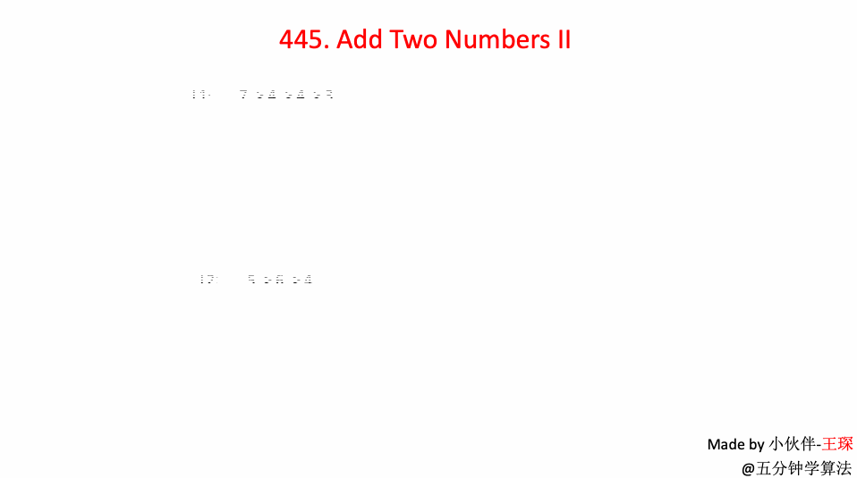

# LeetCode 第 445 号问题：两数相加 II

> 本文首发于公众号「图解面试算法」，是 [图解 LeetCode ](<https://github.com/MisterBooo/LeetCodeAnimation>) 系列文章之一。
>
> 同步博客：https://www.algomooc.com

题目来源于 LeetCode 上第 445 号问题：两数相加 II。题目难度为 Medium，目前通过率为 48.8% 。

### 题目描述

给定两个**非空**链表来代表两个非负整数。数字最高位位于链表开始位置。它们的每个节点只存储单个数字。将这两数相加会返回一个新的链表。

 

你可以假设除了数字 0 之外，这两个数字都不会以零开头。

**进阶:**

如果输入链表不能修改该如何处理？换句话说，你不能对列表中的节点进行翻转。

**示例:**

```
输入: (7 -> 2 -> 4 -> 3) + (5 -> 6 -> 4)
输出: 7 -> 8 -> 0 -> 7
```

### 题目解析

由于计算时要保证最右边的数对齐，那么很自然的想到先用**栈**存放链表中的每个值，然后依次计算。由于相加时可能产生进位，所以使用一个flag表示是否有进位。   

提示：若栈中元素相加结束之后仍有进位，则需要新加入一个头结点。

### 动画描述



### 代码实现

```python
class Solution3:
    def addTwoNumbers(self, l1, l2):
        # 分别入栈
        stack1 = []
        stack2 = []
        while l1:
            stack1.append(l1.val)
            l1 = l1.next
        while l2:
            stack2.append(l2.val)
            l2 = l2.next

        flag = 0
        head = None
        while stack1 or stack2 or flag != 0:
            if stack1:
                flag += stack1.pop()
            if stack2:
                flag += stack2.pop()
            node = ListNode(flag % 10)
            node.next = head
            head = node
            flag = flag // 10
        return head
```


