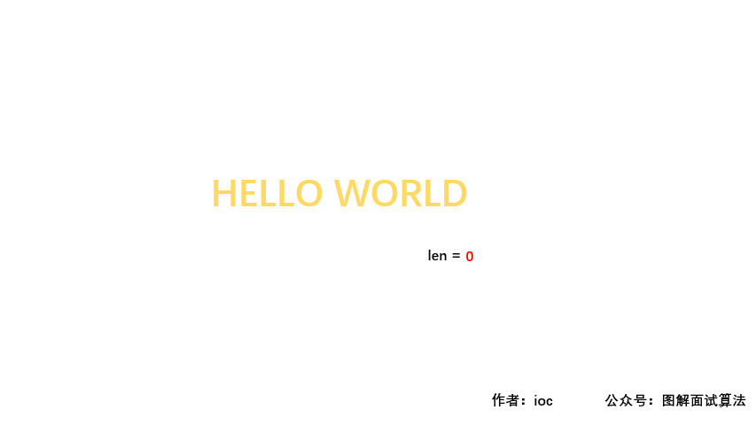

## LeetCode第58号问题：最后一个单词的长度

### 题目描述：
```txt
给定一个仅包含大小写字母和空格' '的字符串s，返回其最后一个单词的长度。
如果字符串从左向右滚动显示，那么最后一个单词就是最后出现的单词。
如果不存在最后一个单词，请返回0。
说明：一个单词是指仅由字母组成、不包含任何空格字符的最大子字符串。

示例:
输入:"Hello World"
输出:5
```

### 题目分析：

既然需要求出最后一个单词的长度，那我们直接从**字符串的末尾**开始好了；
这里末尾有两种情况：有空格和没有空格

```
（1）有空格：我们从末尾忽略掉空格，然后找到第一个遇见的字符（遇到第一个空格或者遍历完整个字符串为止）
（2）无空格：直接从末尾往前寻找即可（遇到第一个空格或者遍历完整个字符串为止）
```

### 动画gif演示：



### 代码：

**The first version**

```java
public int lengthOfLastWord(String s) {
    if (s.length()==0) {
        return 0;
    }
    int index = 0;
    int temp = 0;
    int p = s.length()-1;
    while ((p-index >=0) && s.charAt(p-index) == 32) index++;
    for (int i = p-index;i >= 0;i--) {
        if (s.charAt(i) != 32){
            temp++;
            continue;
        }
        break;   
    }
    return temp;
}
```

**2.代码：**

**The second version**

```java
public int lengthOfLastWord(String s) {
    int len = 0;
    for (int i = s.length() - 1; i >= 0; i--) {
        if (s.charAt(i) != ' ') {
            len++;
        } else if (len != 0) {
            return len;
        }
    }
    return len;
}
```

